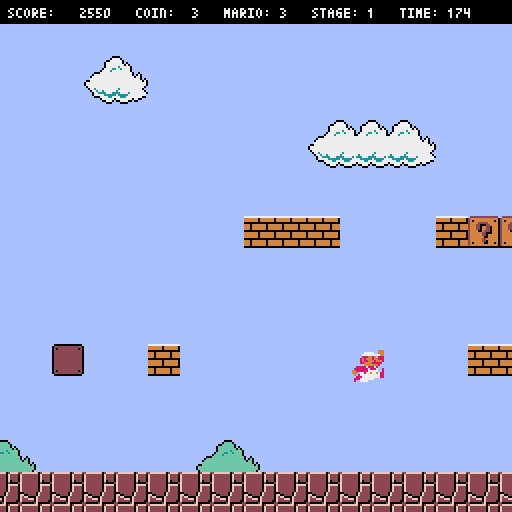

# ミニマリオ

[スーパーマリオブラザーズ](https://www.nintendo.co.jp/software/smb1/index.html)を参考にしました。

## 操作方法

* キーボード、又はゲームパッドで操作します。
  * 【スペース】・・・スタート
  * 【Z】・・・ジャンプ
  * 【SHIFT】・・・ダッシュ（いわゆるBダッシュ）
  * 【←】【→】【↓】・・・移動
* 「MiniMario_MouseOperation.exe」では、マウスでも操作できます。

## 遊び方（特徴）

* 8ステージまであります。
* キノコを取っても大きくなりません。ファイアの出ない「ちびファイアマリオ」になります。
* 左にもスクロールします。
* 敵は、クリボー、トゲゾー、キラー、クッパしかいません。
* ゴールすると空に吸い込まれます。

## 実行

* https://aged99oow.github.io/mario/
